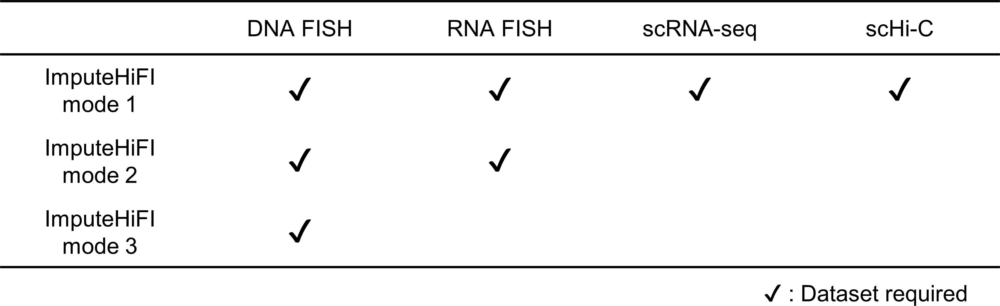

# ImputeHiFI 

## ImputeHiFI: an imputation method for single-cell multiplexed DNA FISH data by utilizing single-cell Hi-C and RNA FISH data

ImputeHiFI has three modes to accommodate different data scenarios.




The workflow of ImputeHiFI mode 1.


## Installation instructions

### Dependences

- Python 3.9
- scanpy

- pandas 
- numpy 
- tqdm
- scipy
- matplotlib 
- seaborn
- portalocker


## Installation

### Method1: to install the conda environment
Step1:
```
git clone https://github.com/zhanglabtools/ImputeHiFI
cd ImputeHiFI
```

Step2:  

```
conda env create --name ImputeHiFI -f environment.yml
```

Step3:
```
conda activate ImputeHiFI
```

In this environment, all the need of ImputeHiFI have been installed.

### Method2: install from Pypi

```
pip install ImputeHiFI
```


## Documentation
See [Tutorial_run_ImputeHiFI.ipynb](./Tutorials/Tutorial_run_ImputeHiFI.ipynb) for the usage of ImputeHiFI.

The data used in the tutorial can be downloaded [here](https://drive.google.com/file/d/1TODpix56NJHNdfjEpLa-YwY33EZpMRUu/view?usp=sharing).

# Contact information

More information please contact Shichen Fan at 2784225493@qq.com.

# References	  


If ImputeHiFI is used in your research, please cite our paper:

> ImputeHiFI: An Imputation Method for Multiplexed DNA FISH Data by Utilizing Single-Cell Hi-C and RNA FISH Data
